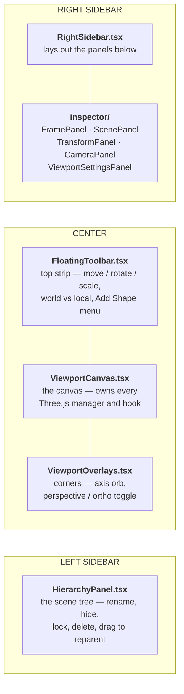
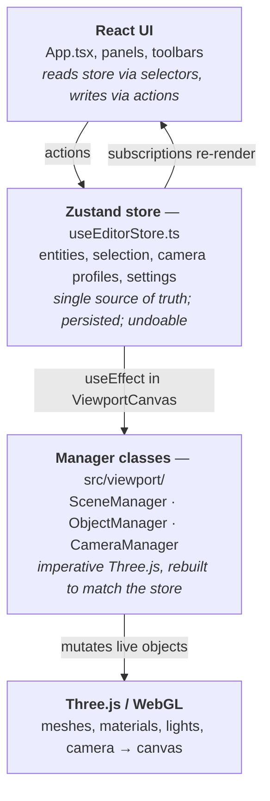
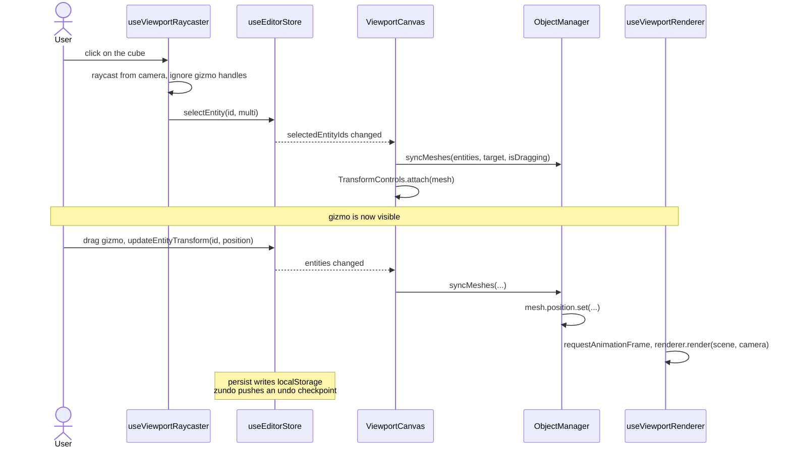

# Libre3D Architecture

Everything in Libre3D is one loop: **you do something → the store changes → the Three.js scene is rebuilt to match → the screen redraws.** If you understand that loop, you can find your way around any part of this codebase.

This document is the map. Read it once before your first change.

---

## 1. The editor, region by region

Every region of the UI is owned by one file. Run `pnpm dev`, put the editor on one half of your screen and this diagram on the other — when you want to change something you can see, this is where you look:



`App.tsx` also hand-routes `/v/:sceneId` to the read-only `PublicViewer` instead of the editor — that's the published-scene view, and it shares the same viewport code with all the editing chrome stripped out.

---

## 2. Three layers



The one rule that follows from this picture: **the store is the truth, and the Three.js scene is derived from it.** You never update a mesh and the store separately. You update the store, and the mesh follows.

---

## 3. The loop, end to end

Here is what actually happens when you click a cube and drag it upward. Every other interaction in the editor is a variation on this.



Two things happen automatically at the end of every store change, and you do not write code for either:

- **Persistence** — the `persist` middleware serializes the store to `localStorage["editor-store"]`.
- **Undo** — the `zundo` middleware pushes a checkpoint, so `Ctrl+Z` works on your feature for free.

---

## 4. The managers

All three live in [`src/viewport/`](../apps/editor/src/viewport/) and are plain TypeScript classes — no React. They are constructed once in `ViewportCanvas` and kept for the life of the editor.

### SceneManager — owns the `THREE.Scene`

```typescript
new SceneManager(initialSettings: EditorState["sceneSettings"])

scene: THREE.Scene            // public — the live scene
gridHelper: THREE.GridHelper  // public — the XZ grid (X axis red, Z axis blue)

updateBackground(color: string)
updateFog(enabled: boolean, color: string)
updateLightIntensity(intensity: number)
updateGridVisibility(visible: boolean)
dispose()
```

### ObjectManager — reconciles entities against meshes

This is the heart of the system. It keeps a `Map<entityId, THREE.Object3D>` and, on every store change, makes that map match the entity list:

```typescript
new ObjectManager(scene: THREE.Scene, meshMap: Map<string, THREE.Object3D>)

syncMeshes(
  entities: Entity[],
  transformTarget: THREE.Object3D | null,
  isDragging: boolean
): Set<string>

getObject(id: string): THREE.Object3D | undefined
disposeSceneObject(obj: THREE.Object3D): void
```

`syncMeshes` does three things in order: dispose meshes whose entity is gone, create meshes for entities that have none, and update every surviving mesh's transform, visibility, and material. The `isDragging` flag exists so a mesh you are actively dragging isn't fought over by the sync.

**Why reconcile instead of mutating in place?** Entity data changes for many reasons — undo, GLB import, a paste, a migration on load. Reconciliation handles all of them with one code path.

### CameraManager — two cameras, one active

```typescript
new CameraManager(
  initialProfile: EditorState["cameraProfiles"][string],
  initialMode: "perspective" | "orthographic",
  aspect: number
)

perspectiveCamera: THREE.PerspectiveCamera    // public
orthographicCamera: THREE.OrthographicCamera  // public
activeCamera: THREE.Camera                    // public — whichever is "on"

updateAspect(width: number, height: number)
setActiveMode(mode: "perspective" | "orthographic")
syncWithProfile(profile, orbitControlsTarget: THREE.Vector3)
```

**Why keep both cameras alive?** Swapping the camera object would mean tearing down and re-subscribing OrbitControls, TransformControls, and the raycaster. Instead all three read `cameraRef.current`, and switching projection is just reassigning that ref:

```typescript
cameraManager.setActiveMode(projectionMode);
cameraRef.current = cameraManager.activeCamera;
```

### The viewport hooks

These live in [`src/viewport/hooks/`](../apps/editor/src/viewport/hooks/) and hold the React-specific pieces. Note that all three take `cameraRef`, not a camera — that's the pattern above.

| Hook | Owns | Signature |
|---|---|---|
| `useViewportRenderer` | `WebGLRenderer`, the `requestAnimationFrame` loop, the FPS overlay | `(containerRef, scene, cameraRef, onRender?)` |
| `useViewportControls` | `OrbitControls` (camera) + `TransformControls` (gizmo) | `(cameraRef, rendererRef, scene)` |
| `useViewportRaycaster` | click-to-select, box-select, gizmo-click rejection | `(cameraRef, rendererRef, meshMap, transformControlsRef)` |

---

## 5. The store

One Zustand store, [`useEditorStore.ts`](../apps/editor/src/store/useEditorStore.ts), wrapped in three middlewares:

```typescript
subscribeWithSelector(   // .subscribe() with a selector
  temporal(              // zundo — undo/redo
    persist(             // localStorage + versioned migrations
      (set, get) => ({ /* state and actions */ }),
      { name: "editor-store", version: 16, partialize, migrate, merge: deepMerge }
    )
  )
)
```

**Reading**

```typescript
const entities = useEditorStore((s) => s.entities);   // re-renders on change
const state    = useEditorStore.getState();           // one-shot, no re-render
```

**Writing** — always through an action, never `setState` from a component. A direct `setState` skips zundo, so your change becomes un-undoable.

```typescript
const addEntity = useEditorStore((s) => s.addEntity);
addEntity("cube");
```

`partialize` decides what survives a reload. If you add a field and forget to list it there, it will silently reset every time the page loads. The full action list is in [store-api-reference.md](store-api-reference.md).

---

## 6. Four rules you have to follow

These are the ones that cause real bugs. They also appear in [CLAUDE.md](../CLAUDE.md) and [conventions.md](conventions.md).

**1. Clone vectors — never hand out a live reference.**

```typescript
// mutates the store in place; undo and re-renders break
const pos = entity.position;
pos[1] += 5;

// do this instead
const [x, y, z] = entity.position;
updateEntityTransform(id, { position: [x, y + 5, z] });
```

**2. Update nested config through its action, never by replacing the object.** `sceneSettings`, `postProcessing`, and `frame` are deep-merged so a field you didn't touch — including one added after a user's save was written — keeps its value.

```typescript
updateSceneSettings({ bgColor: "#ff0000" });      // merges
set({ sceneSettings: { bgColor: "#ff0000" } });   // drops every other setting
```

**3. Bump the persist `version` whenever you change the store's shape,** and add a matching `if (version < N)` block in `migrate`. Existing users have the old shape sitting in `localStorage`; without a migration they get `undefined` where your code expects a value.

**4. Read the camera through `cameraRef.current`,** never by capturing a camera object. See CameraManager above.

---

## 7. Why not react-three-fiber?

A fair question, since most React + Three.js projects use it. Libre3D doesn't, for two reasons:

- **The viewport isn't UI.** RTF's value is describing a scene declaratively as JSX. Here the scene is user-authored data arriving from the store, GLB imports, and undo — a reconciler we control (`syncMeshes`) is more direct than one we configure.
- **We need explicit disposal.** Geometry, materials, and textures must be disposed by hand or the app leaks GPU memory across scene edits. That's ObjectManager's job, and it's easier to get right with direct ownership.

The practical upside for you: Three.js documentation and examples apply to this codebase directly, with no translation layer.

---

## Where to go next

- **Making your first change** → [templates/add-entity-type.md](templates/add-entity-type.md)
- **Adding a sidebar control** → [templates/add-inspector-panel.md](templates/add-inspector-panel.md)
- **Every store action** → [store-api-reference.md](store-api-reference.md)
- **Which file does what** → [project_index.md](project_index.md)
- **Something's broken** → [troubleshooting.md](troubleshooting.md)

### Poking at it live

The editor exposes three handles on `window` in development:

```javascript
__libre3dStore      // the Zustand store itself
__libre3dScene      // the live THREE.Scene
__libre3dViewport   // { sceneManager, objectManager }

__libre3dStore.getState().entities
__libre3dScene.children.forEach(o => console.log(o.name, o.position))
localStorage.removeItem("editor-store"); location.reload();   // reset to a clean scene
```
